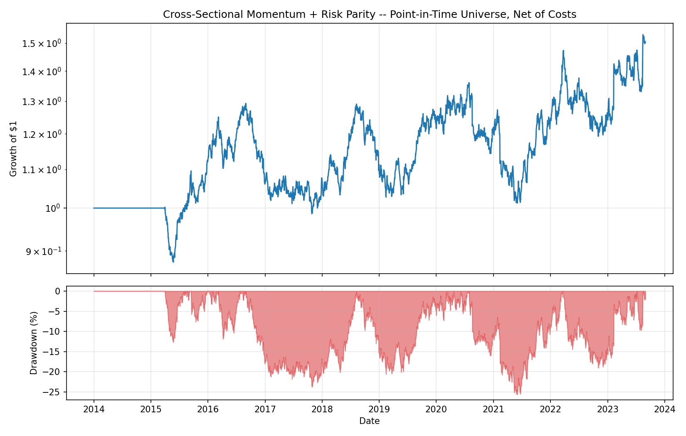
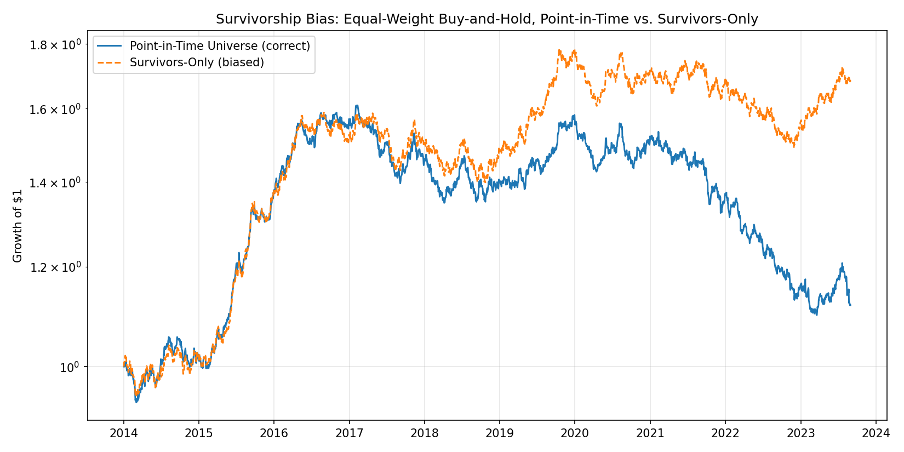
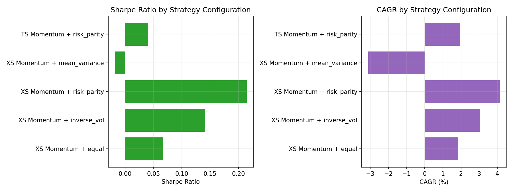

# Quantitative Momentum Trading Strategy Backtester

A vectorized Python backtesting engine for time-series and cross-sectional
equity momentum strategies, built with **pandas**, **NumPy**, and **SciPy**.
It models realistic market frictions (transaction costs, slippage, and
survivorship bias) and optimizes portfolio weights with **Risk Parity** and
**Mean-Variance (Markowitz) optimization**, reporting standard risk-adjusted
performance metrics (Sharpe, Sortino, Max Drawdown, Calmar, CAGR).

Built by Djallil Azouz as a portfolio project. The entire pipeline runs
end-to-end on synthetic data with no network dependency, so it is fully
reproducible and CI-friendly.

## Why this project

Momentum is one of the most studied and traded anomalies in quantitative
equity investing, but most toy backtests are misleading: they loop over time
in Python (slow, and easy to introduce lookahead bugs in), ignore transaction
costs, and silently condition on "the stocks that are still around today,"
which overstates historical performance (survivorship bias). This project
addresses all three:

1. **Vectorized engine.** No Python-level loop over trading days anywhere in
   the simulation critical path -- the whole P&L calculation is `.shift()`,
   elementwise array arithmetic, and `.cumprod()`.
2. **Realistic frictions.** Every rebalance pays a configurable transaction
   cost + slippage (in bps) on turnover, charged directly against strategy
   returns.
3. **Survivorship bias, demonstrated, not just mentioned.** A synthetic
   point-in-time universe lets stocks delist mid-sample (with a realistic
   negative "delisting shock" concentrated in the worst historical
   performers), and the example script backs out exactly how much a
   survivors-only backtest overstates performance versus the correct
   point-in-time universe.

## Architecture

```
src/momentum_backtester/
├── data.py        Synthetic multi-asset price generation
│                   - generate_gbm_universe(): correlated GBM price paths
│                     (one-factor correlation model + per-asset drift/vol)
│                   - simulate_delistings(): overlays a point-in-time
│                     universe (membership matrix) with realistic delisting
│                     shocks concentrated in the worst historical performers
│                   - survivors_only_prices(): the biased view a naive
│                     backtest would use
│
├── signals.py      Momentum signal construction (fully vectorized)
│                   - trailing_return(): O(1) vectorized lookback via
│                     .shift(), with a configurable "skip" (the "-1" in
│                     "12-1" momentum, to avoid short-term reversal)
│                   - time_series_momentum_signal(): sign of trailing
│                     return, per asset, independent of the cross-section
│                   - cross_sectional_momentum_signal(): rank assets each
│                     rebalance, long the top decile / short the bottom
│                     decile (or long-only top-N)
│
├── weighting.py    Portfolio weighting (real scipy.optimize, not a
│                   closed-form shortcut)
│                   - equal_weights, inverse_vol_weights (closed-form)
│                   - risk_parity_weights(): Equal Risk Contribution via
│                     scipy.optimize.minimize (SLSQP)
│                   - mean_variance_weights(): Markowitz max-Sharpe / 
│                     min-variance via scipy.optimize.minimize
│                   - build_portfolio_weights(): turns a signal panel into
│                     a full daily weight panel, solving one (small) 
│                     optimization per rebalance date
│
├── engine.py       The vectorized backtest engine
│                   - run_backtest(): turns (prices, weights) into a
│                     cost-and-slippage-adjusted equity curve, with a
│                     documented no-lookahead timing convention and an
│                     optional point-in-time membership mask
│
└── metrics.py      Risk-adjusted performance metrics
                    - CAGR, annualized volatility, Sharpe, Sortino,
                      Max Drawdown, Calmar -- all with correct annualization
                      and a proper downside-deviation Sortino
```

`examples/run_backtest.py` wires all five modules together: generate data →
build signals → solve weights → run the vectorized backtest with costs/
slippage → compute metrics → save charts. `examples/fetch_real_data.py` is a
clearly separated, opt-in script that runs the identical pipeline on real
tickers via `yfinance` -- kept out of the tested core so the test suite never
depends on network access.

### No-lookahead timing convention

`weights.loc[t]` is the target decided using information available at (or
before) the close of day `t`. The engine applies `weights.shift(1)` against
realized returns, so the return earned on day `t` only ever depends on a
decision made strictly before that return was known. Transaction costs and
slippage are charged as a single all-in bps rate on turnover
(`sum(|w_t - w_{t-1}|)`), recognized on the date the weight change occurs.

## Installation

```bash
git clone https://github.com/trojanhorse01/momentum-backtester.git
cd momentum-backtester
pip install -e ".[dev]"        # core + pytest
# optional, for the real-data example:
pip install -e ".[yfinance]"
```

Requires Python 3.10+.

## Usage

Run the full example pipeline (synthetic data, no network access needed):

```bash
python examples/run_backtest.py
```

This generates a 45-ticker, 10-year synthetic universe, computes cross-
sectional momentum signals, solves risk-parity portfolio weights every
quarter, runs the vectorized backtest net of transaction costs and slippage,
prints the performance tables below, and writes three charts + a CSV to
`examples/output/`.

Minimal library usage:

```python
from momentum_backtester.data import generate_gbm_universe
from momentum_backtester.signals import cross_sectional_momentum_signal
from momentum_backtester.weighting import build_portfolio_weights
from momentum_backtester.engine import run_backtest
from momentum_backtester.metrics import performance_summary

prices = generate_gbm_universe(n_assets=40, n_years=10, seed=42)
signal = cross_sectional_momentum_signal(prices, lookback=252, skip=21, top_frac=0.3, bottom_frac=0.3)
weights = build_portfolio_weights(prices, signal, method="risk_parity", rebalance="ME")
result = run_backtest(prices, weights, cost_bps=10, slippage_bps=5)

print(performance_summary(result.net_returns))
```

Run the test suite:

```bash
pytest -v
```

## Sample results

*(from `python examples/run_backtest.py`, synthetic universe, seed=42 -- see
that file's docstring for exact parameters. Deliberately not cherry-picked:
this is the library's default example seed.)*

### Cross-sectional momentum + risk parity (point-in-time universe, net of costs)

| Metric | Value |
|---|---|
| Total Return | 50.1% |
| CAGR | 4.15% |
| Annualized Volatility | 14.4% |
| Sharpe Ratio | 0.21 |
| Sortino Ratio | 0.32 |
| Max Drawdown | -25.6% |
| Calmar Ratio | 0.16 |



### Survivorship bias: point-in-time vs. survivors-only

Same synthetic universe, simple equal-weight long-only buy-and-hold (isolated
from the momentum strategy's own stock selection so the universe-construction
effect is measured cleanly), zero cost:

| Metric | Point-in-Time (correct) | Survivors-Only (biased) | Bias |
|---|---|---|---|
| CAGR | 1.12% | 5.33% | **+4.21pp** |
| Sharpe Ratio | -0.07 | 0.46 | **+0.53** |
| Max Drawdown | -31.8% | -16.5% | **+15.3pp (understated)** |

Excluding the 16 of 45 names that were simulated to delist (with the
delisting probability concentrated in the worst historical performers, as in
reality) turns a flat, slightly-losing strategy into an apparently solid one
-- entirely an artifact of which tickers happened to survive to the end of
the sample.



### Weighting scheme & signal-type comparison

| Configuration | CAGR | Sharpe | Max Drawdown |
|---|---|---|---|
| XS Momentum + Equal Weight | 1.85% | 0.07 | -34.8% |
| XS Momentum + Inverse Volatility | 3.05% | 0.14 | -28.3% |
| **XS Momentum + Risk Parity** | **4.15%** | **0.21** | **-25.6%** |
| XS Momentum + Mean-Variance (max Sharpe) | -3.12% | -0.02 | -71.6% |
| TS Momentum + Risk Parity | 1.95% | 0.04 | -37.0% |



Risk parity outperforms naive equal-weighting here by systematically
downweighting the noisiest, most volatile names in the long/short books.
Mean-variance optimization does noticeably *worse* -- a well-documented,
realistic failure mode: with only ~63 days of trailing returns to estimate a
full covariance matrix (and noisy sample means driving the max-Sharpe
objective), Markowitz optimization is highly sensitive to estimation error
and tends to make large, concentrated, unstable bets. This is exactly why
risk parity is popular in practice for momentum sleeves, and the comparison
is left in deliberately rather than hidden.

Full metrics for every table above are saved to
`examples/output/metrics_summary.csv` by the example script.

## Testing

40 tests across metrics, weighting, signals, the backtest engine, and the
data generator / survivorship-bias effect, including:

- Hand-computable known-answer cases for CAGR, Sharpe, Sortino, and Max
  Drawdown (e.g. a known equity path `100 → 110 → 90 → 120` has an exact,
  independently-computed max drawdown).
- Risk parity weights verified to equalize percentage risk contribution
  (and to match the closed-form inverse-volatility solution in the
  uncorrelated-assets special case).
- Mean-variance weights verified to satisfy the budget constraint
  (`sum(w) == 1`) and to achieve lower variance than equal weighting on the
  min-variance objective.
- Backtest engine sanity checks: an all-zero signal produces exactly zero
  turnover, zero cost, and a flat equity curve; a zero-cost run matches a
  manually-computed buy-and-hold return series exactly.
- The survivorship-bias effect itself is a regression-tested assertion
  (`survivors-only CAGR > point-in-time CAGR`), not just a one-off script
  result.

```bash
pytest -v
```

## Tech stack

Python, pandas, NumPy, SciPy (`scipy.optimize.minimize`, SLSQP) for portfolio
optimization, Matplotlib for charts, pytest for testing, GitHub Actions for
CI (Python 3.10 / 3.11 / 3.12 on ubuntu-latest).

## Disclaimer

This is a research/educational backtesting framework built on synthetic data
for portfolio-demonstration purposes. It is not investment advice, and past
(or simulated) performance is not indicative of future results.

## License

MIT -- see [LICENSE](LICENSE).
